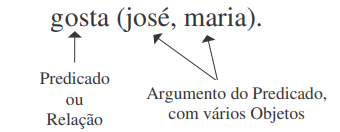

# Prolog-Study-case

Estudo de caso desenvolvido para apresentação na materia de LP

Prolog é uma linguagem de programação que se enquadra no paradigma de Programação em Lógica Matemática. É uma linguagem de uso geral que é especialmente associada com a inteligência artificial e linguística computacional. Consiste numa linguagem puramente lógica, que pode ser chamada de Prolog puro, e numa linguagem concreta, a qual acrescenta o Prolog puro com componentes extra-lógico.

## 📌Histórico 
A linguagem de programação Prolog nasceu de um projeto que não focava em implementações de linguagens de programação, mas sim em processamento de linguagem natural. Na Universidade de Marselha, Alain Colmerauer e Robert Pasero trabalharam na parte da linguagem natural, e Jean Trudel e Philippe Roussel trabalharam na parte dedutiva do projeto. Trudel, interessado em métodos de resolução de SL, convenceu um de seus inventores, Robert Kowalski, a participar do projeto. O projeto produziu uma versão preliminar da linguagem Prolog no final de 1971, com a versão final aparecendo no final de 1972.

## Características 

O Prolog é uma linguagem declarativa, ou seja, não é especificado passo a passo como em linguagens procedurais ou orientadas a objetos, ele fornece d destinado a usar uma coleção de fatos e regras (lógica) para indicar que o problema proposto deve ser foi resolvido. Como vimos, o Prolog está mais preocupado do que o próprio algoritmo.

Além de ser uma linguagem declarativa, outro fato que a diferencia de outras linguagens é que ela não possui as estruturas de controle (if-else, do-while, for, switch) que existem na maioria das linguagens de programação. Para fazer isso, usamos a lógica para declarar como você deve atingir seus objetivos.

Os programas em Prolog podem ser executados de forma interativa e os usuários podem formular consultas usando fatos e regras, resultando em soluções por meio de um mecanismo unificado.

- ESCOPO<br>

## Tipos de dados 
Os tipos de dados comuns em outras linguagens não são usados no Prolog. Todos os dados são tratados como um único tipo, chamado de termo, que pode ser uma constante, variável ou termo composto.

- FATOS<br>
 Em Prolog são fornecidos os fatos e as regras para uma base de dados, que posteriormente serão executadas consultas (queries) em cima da base de dados.
 
 
A estrutura de um fato é formada por um `predicado`, seus `argumentos` e com um ponto`(.)` para finzalizar a instrução seria como ponto-vírgula das linguagens comuns de programação
```
predicado(argumento1,argumento2...).

Ex: Cidade(Cascavel)
```
- QUESTOES<br>
Questão é um fato antecedido de um ponto de interrogação ou o comando apropriado para o tipo de compilador.<br>

```
Por exemplo: ?-Cidade(cascavel).
```
A partir de uma questão feita o Prolog realiza uma busca procurando por uma ocorrencia que seja igual a questão e retornando assim `YES` ou `NO`

- VARIAVEIS<br>
No Prolog as variareis são tratadas como incógnitas das quais o valor é desconhecido, portando devemos instanciar um objeto a essa variável e a mesma não poderá ser mais modificada

- LISTAS<br>
Uma lista é uma sequência finita de elementos. Ex.:

```
[mia, vincent, jules, yolanda]

[mia, robber(honey_bunny), X, 2, mia]

[]

[mia, [vincent, jules], [butch, girlfriend(butch)]]

[[], dead(zed), [2, [b, chopper]], [], Z, [2, [b, chopper]]]

```

- ÁTOMOS<br>
Constantes de texto são introduzidas usando átomos. Um átomo é uma sequência consistindo de letras, sublinhados e sublinhados , mas começando com uma letra minúscula. Se um átomo não alfanumérico for necessário, qualquer sequência de aspas simples pode ser usada.

- NUMEROS<br>
Um número é uma sequência de dígitos que permite também os sinais de .(para números reais), -(número negativo) e e (notação científica). Algumas das implementações do Prolog não fazem distinção entre inteiros e números reais.


- ENTRADA E SAIDA<br>
Assim como em outras linguagens, o Prolog também dispõe propriedades de entrada e saída de dados, são eles read() e write().

```
Ex:read(Termo)
onde ?Termo (variável ou átomo)
Lê um termo do dispositivo de entrada
corrente e unifica com Termo

write(Termo)
onde ?Termo (termo)
Escreve o termo no dispositivo de saída
corrente
```
## Operadores

### Operador `is`

O operador binário `is` é similar ao operador de unificação, `=`, com uma diferença: o lado direito (e apenas o lado direito) é interpretado como uma expressão aritmética e seu resultado é calculado antes da unificação. Exemplos:

```
X is 1 + 2.
3 is 1 + 2.
```

A segunda consulta retorna `true` porque o lado direito do operador `is` é avaliado como expressão aritmética, resultando no valor `3`, e `3` (lado esquerdo) pode ser unificado com `3` (lado direito). Contra-exemplo:

```
1 + 2 is 3.
```

O último exemplo não funciona porque o lado esquerdo do `is` não é avaliado como expressão aritmética. Ao tentar unificar `+(1, 2)` com `3`, a unificação falha.

### Operadores aritméticos

O Prolog possui os operadores mais comuns, como `+`, `-`, `*`, `/`, `abs`, `sin`, `cos`, `tan`, `exp`, `ln`, `sqrt`, dentre outros. A precedência entre operadores é respeitada. Exemplo:

```
X is 1 + 2 * 3.
X is sqrt(9).
```

Não confunda operadores com predicados! Operadores aritméticos são funções que retornam um número.

### Operadores de comparação (ralacionais)

Prolog admite operadores de comparação, como `>` e `<`. Ao usar um desses operadores, ambos os lados são avaliados como expressão aritmética. Exemplos:

```
4 > 3. /*true*/
8 + 1 < 5 + 5. /*true*/
X is +(8, 1), X < X + 1. /*true*/
```

Operadores de comparação:

-	`<`: menor que
-	`>`: maior que
-	`>=`: maior ou igual a
-	`=<`: menor ou igual a (a maioria das outras linguagens usa <=)
-	`=:=`: igual a
-	`=\=`: diferente de

Note que esses operadores não realizam unificação! Por isso, as variáveis devem estar instanciadas antes de se realizar a comparação. Exemplo:

```
X =:= 5.
/* [Error] =:=/2: Arguments are not sufficiently instantiated */
```

## Sentenças

### Operadores de atribuição

Em PROLOG temos 2 operadores de atribuição:

- `=` para a atribuição ximbólica X=a
- `is` para a atribuição numérica X is 5

A atribuição simbólica é bidirecional, para X=Y temos: 

- Se X não está instanciado e Y está então temos X←Y 
- Se X está instanciado e Y não está então temos X→Y
- Se nenhum está instanciado então passam a ser a mesma variável 
- Se ambos estão instanciados com o mesmo valor então há sucesso 
- Se ambos estão instanciados com valores diferentes então ocorre uma falha

```
?- X=Y,X=a.
X = Y = a

?- Y=a,X=Y. 
Y = X = a

?- X=a,X=Y.
X = Y = a
```

- A atribuição numérica é unidirecional.
- Do lado direito do is, se estiverem envolvidas variáveis, elas devem estar instanciadas.
- Do lado esquerdo a variável não deve estar instanciada, senão ocorre uma falha.
- Do lado direito as variável em que apareçam devem estar instanciadas.
- Em PROLOG N is N+1 nunca tem sucesso.

### Laços de repetição

Na sintaxe da linguagem não há laços do tipo "for" ou "while" (apesar de poderem ser facilmente programados), simplesmente porque eles são absolutamente desnecessários.

## Funções

Uma função é um nome de função seguido por uma lista de termos entre parênteses, onde um nome de função tem a forma de um átomo não numérico:

```
Autor_de(scott)

f(x,y,z)

“oi!”(pedro)
```

## Paradigma funcional

- Baseado em declaração e aplicação de funções (cálculo lambda) 
- Todos os parâmetros de uma função precisam estar instanciados 
- Clara distinção entre entrada e saída

## Termos: Constante, variável e estrutura

Um termo pode ser uma constante, uma variável, ou uma estrutura.

- As constantes podem ser átomos ou números. Quem conhece LISP notará uma diferença aqui: os números são considerados átomos em LISP, mas em Prolog números não são átomos (embora ambos sejam constantes).
- Um átomo indica um objeto ou uma relação. Nomes de objetos como maria, livro, etc. são átomos. Nomes de átomos sempre começam com letra minúscula. Nomes de predicados são sempre atômicos também. Os grupos de caracteres `?-` (usado em perguntas) e `:-` (usado em regras) são também átomos. Átomos de comprimento igual a um são os caracteres, que podem ser lidos e impressos em Prolog, como veremos no capítulo sobre entrada e saída.
- Sintaticamente, as variáveis têm nomes cujo primeiro caractere é uma letra maiúscula ou o sinal de sublinhado (underscore) `_`. Estas últimas são chamadas de variáveis anônimas. 
- Variáveis com o mesmo nome aparecendo numa mesma cláusula são a mesma variável, ou seja, se uma ganha um valor, este valor passa imediatamente para as outras ocorrências, exceto para variáveis anônimas. As variáveis anônimas são diferentes das outras nos seguintes aspectos: (1) cada ocorrência delas indica uma variável diferente, mesmo dentro de uma mesma cláusula, e (2) ao serem usadas numa pergunta, seus valores não são impressos nas respostas. Variáveis anônimas são usadas quando queremos que unifiquem com qualquer termo, mas não nos interessa com qual valor serão instanciadas.
- As estruturas são termos mais complexos formados por um funtor seguido de componentes separadas por vírgula e colocadas entre parênteses. Por exemplo, para indicar um livro com seu título e autor podemos usar a estrutura abaixo: 

```
livro(incidente_em_antares, verissimo).
```

Observe que os fatos de um banco de dados em Prolog são estruturas seguidas de um ponto final. 

- Estruturas podem ser aninhadas. Se quisermos sofisticar a indicação dos livros, colocando nome e sobrenome do autor para poder diferenciar entre vários autores com o mesmo sobrenome, podemos usar: 

```
livro(incidente_em_antares, autor(erico, verissimo)). 
```
- Estruturas podem ser argumentos de fatos no banco de dados: 
```
pertence(ze, livro(incidente_em_antares, verissimo)).
```

## Declaração de Fatos

Os fatos são os elementos fundamentais da programação em Prolog, pois determinam as relações que existem entre os objetos conhecidos. Exemplo: 



Características dos fatos: 
- Os nomes dos predicados e dos objetos devem começar com letra minúscula. Por exemplo: joão, casa, gosta. 
- Os predicados são escritos primeiro e os objetos são escritos depois, separados por vírgulas.
- Os objetos são escritos dentro de parênteses.
- Todo fato é terminado com um ponto final. 
- A ordem dos objetos é importante: gosta (maria, josé). ≠ gosta (josé, maria). 
- Uma coleção de fatos é chamada de “banco de conhecimento” ou “banco de dados”. 
- Os fatos podem ter um número arbitrário de objetos como argumento.

## Declaração de Regras

As regras são utilizadas para construir relações entre fatos, explicitando as dependências entre eles.

Ao contrário dos fatos, que são incondicionais, as regras especificam coisas que podem ser verdadeiras se algumas condições forem satisfeitas. 

As regras possuem duas partes: 
- o corpo, que define as condições e se encontra na parte direita da regra, e 
- a cabeça, que define a conclusão, e se encontra na parte esquerda da regra.

A cabeça e o corpo são separados pelo símbolo `:-`, que é lido como “se”. 

Uma regra sempre é terminada com um ponto final.

```
gosta (joão, X) :- gosta (X, vinho).

gosta (joão, X) :- gosta (X, vinho), gosta (X, comida).

filho (X, Y) :- homem (X), genitor(Y, X).
```

## Declaração de Metas

Prolog é uma linguagem interpretada e seu interpretador usa como prompt o sinal `?-`. Uma pergunta tem a mesma sintaxe da cauda de uma regra. Ao receber uma pergunta, Prolog trata cada um dos termos dela como metas a serem verificadas contra o banco de dados (descrição do mundo). Se a meta casa com um fato, ela é tida como verdadeira. Dizemos que a meta foi satisfeita. Se a meta casa com a cabeça de uma regra, ela produz submetas para cada termo da cauda da regra. Se uma meta não casa com nenhum fato nem com a cabeça de nenhuma regra, ela falha, ou seja, é considerada falsa. A falha de uma meta desencadeia o backtracking.

## Processo de Inferência

A máquina de inferência do Prolog é capaz de realizar deduções lógicas a partir desta base de conhecimento e produzir conhecimento novo. Considere, por exemplo, as seguintes proposições [3]:

```
1 Todos os homens são mortais. 
2 Platão é um homem. 
3 Platão é mortal.
```

Para a lógica, as duas primeiras proposições são premissas e a terceira é a conclusão lógica destas premissas. Na lógica de predicados de primeira ordem tem-se:

```
∀X(homem(X) → mortal(X))  (1) 
Homem (platao)  (2) 
Mortal (platao) (3) 
```

Onde a terceira fórmula seria facilmente obtida a partir das duas primeiras usando qualquer ferramenta lógica de dedução, como por exemplo a regra da resolução.

Toda implicação da lógica da forma a → b, equivalente a ¬a ∨ b, gera uma regra Prolog da forma b :- a. 

Logo, um programa Prolog para esta base de conhecimento seria:

```
Mortal (X) :- homem(X). 
Homem (platão).
```

A partir deste programa, ao se perguntar se mortal (platão) é verdadeiro, a máquina de inferência do Prolog responde que sim (yes).

## CAbeça e cauda

Uma lista não-vazia pode ser pensada como tendo duas partes:
- o	cabeça (head): primeiro elemento da lista
- o	cauda (tail): lista que sobra quando retiramos a cabeça

## Aplicações

Atualmente, o Prolog é utilizado em diversas aplicações na área de computação simbólica, incluindo-se aí: bases de dados relacionais, sistemas especialistas, lógica matemática, prova automática de teoremas, resolução de problemas abstratos e geração de planos, processamento de linguagem natural, projeto de arquiteturas, logística, resolução de equações simbólicas, construção de compiladores, análise bioquímica e projeto de fármacos.

## Principais aplicações

- Principais aplicações se dão na área de computação simbólica:
- Lógica matemática, prova automática de teoremas e semântica;
- Solução de equações simbólicas;
- Bancos de dados relacionais;
- Linguagem Natural;
- Sistemas Especialistas;
- Planejamento Automático de Atividades;
- Aplicações de "General Problem Solving", como jogos (Xadrez, Damas, Jogo da Velha, etc.);
- Compiladores;
- Análise Bioquímica e projetos de novas drogas.

## Referências

PROLOG: aritmética. [S. l.]. Disponível em: https://rodrigorgs.github.io/mata56-20161/aula05-prolog-aritmetica.html. Acesso em: 9 ago. 2022.

ALGORITMIA_AVANÇADA_TP_PROLOG v2. [S. l.]. Disponível em: https://www.dei.isep.ipp.pt/~jtavares/ALGAV/downloads/ALGAV_TP_aula4.pdf. Acesso em: 9 ago. 2022.

MC346 - Paradigmas de programação Prolog. [S. l.], 2017. Disponível em: https://www.ic.unicamp.br/~meidanis/courses/mc346/2017s2/prolog/apostila-prolog.pdf. Acesso em: 9 ago. 2022.

PROLOG. [S. l.]. Disponível em: http://www2.unemat.br/rhycardo/download/apostila_de_prolog.pdf. Acesso em: 9 ago. 2022.

NOTAS de Aula - Prolog. [S. l.]. Disponível em: https://www.ic.unicamp.br/~meidanis/courses/mc600/200002/Prolog/aulas.html. Acesso em: 9 ago. 2022.

PROLOG: listas. [S. l.]. Disponível em: https://rodrigorgs.github.io/aulas/mata56/aula06-prolog-listas. Acesso em: 9 ago. 2022.

PROLOG. [S. l.]. Disponível em: https://ww2.inf.ufg.br/~eduardo/lp/alunos/prolog/prolog.html. Acesso em: 9 ago. 2022.
